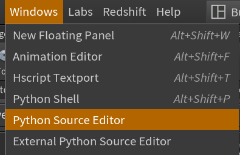
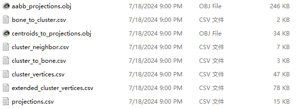
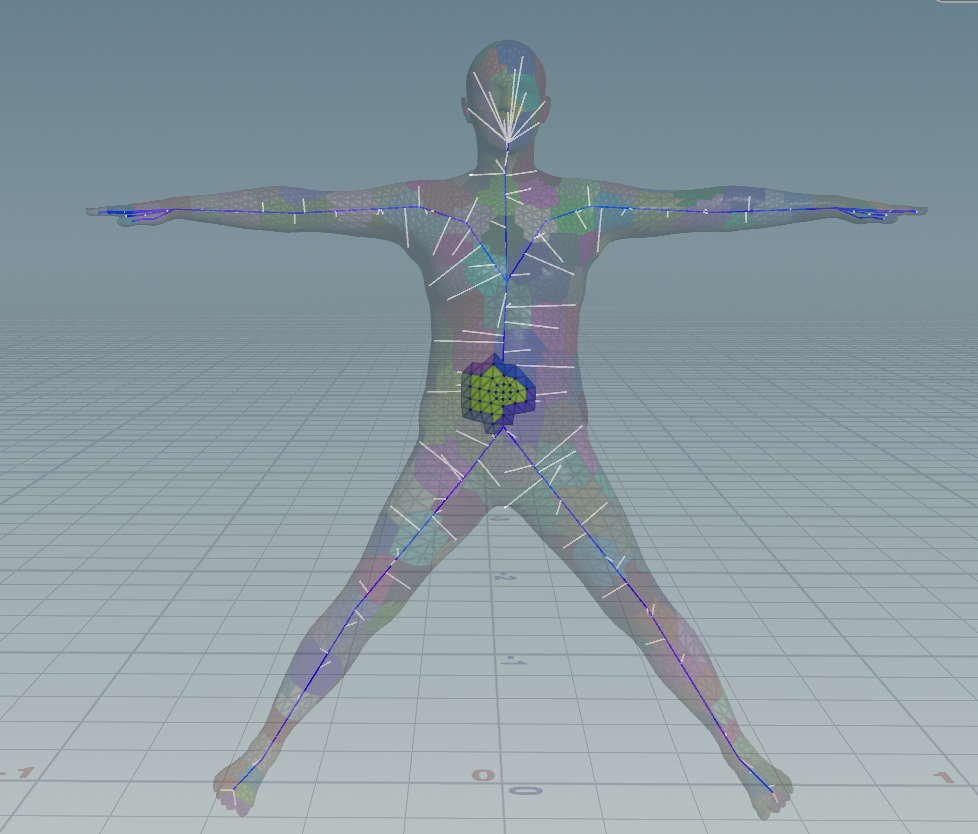
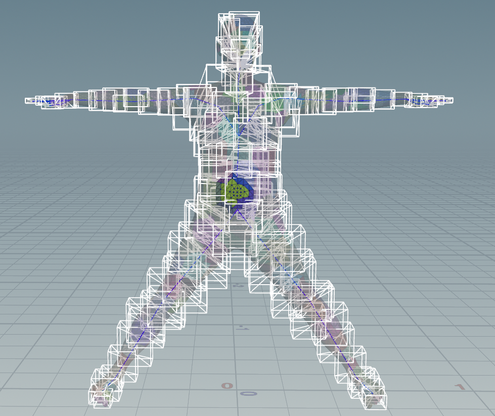

### SMPL regist to skeleton template
This project aims to regist surface cluster to skeleton for domain decomposition. The clusters are regist to one or some spatial adjacent bones respected to skeleton template. We provided the patchlization method. (You can you your own.)
### Usage
install the requirement on requirements.txt

The data is placed as it (in data).
The output is in output_clusters and regist_file.

You can use Houdini to visualize the project. (We provide an internal python script).

## Setting
You can set the cluster size of the body. Please provided an input obj file. If the cluster is required to regist to the skeleton, please provided the skeleton (obj segment file).
We provide two registing strategies.

### Output
  1. cluster and one-ring neighbor output are on output_clusters\
  2. regist table and visualization file are on regist_file

### Two way regist strategy
  1. According to the geometry center of the cluster: match it to the nearest skeleton proximal projection point.
    
  2. According to the AABB of the cluster: match each corner point of the AABB to the nearest skeleton proximal projection point.(each cluster may have more than one registed bone, but will act well near joints).
    

### Cluster strategy
 K-mean algorithm (equal cluster area, so the vertex within the cluster may vary a lot.)

## All the project are guided and generated via Chatgpt.